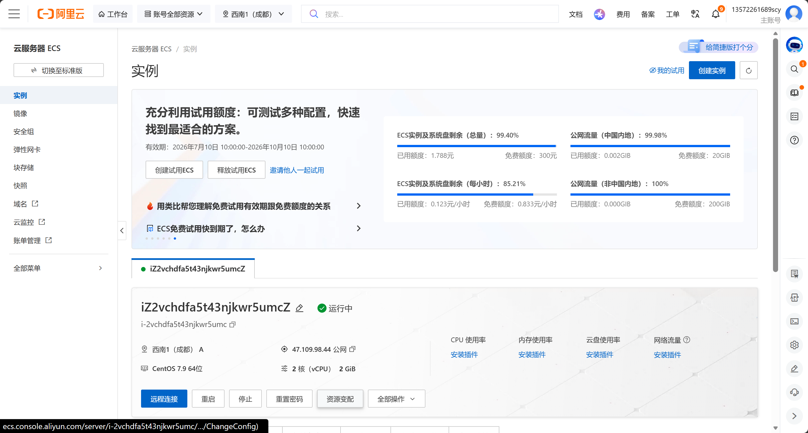
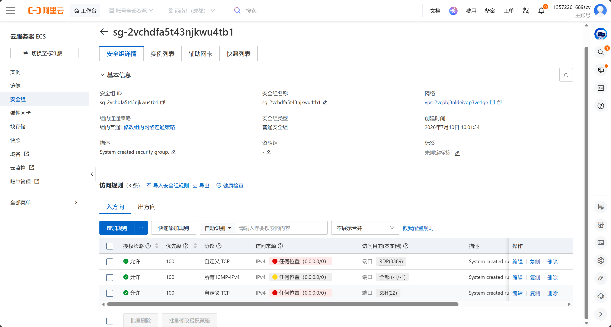
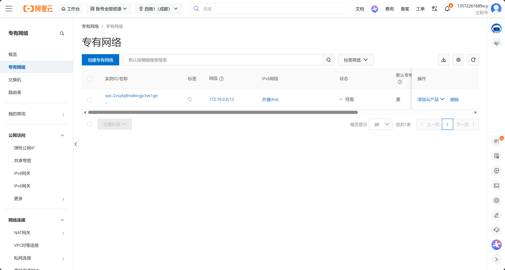
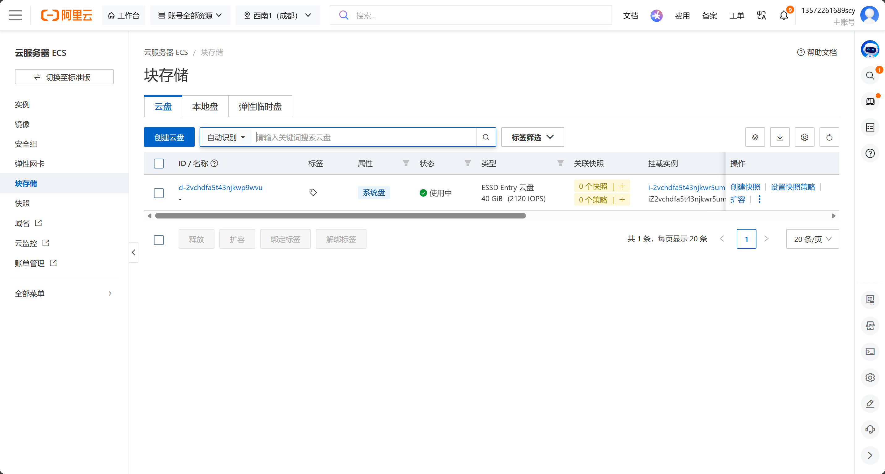
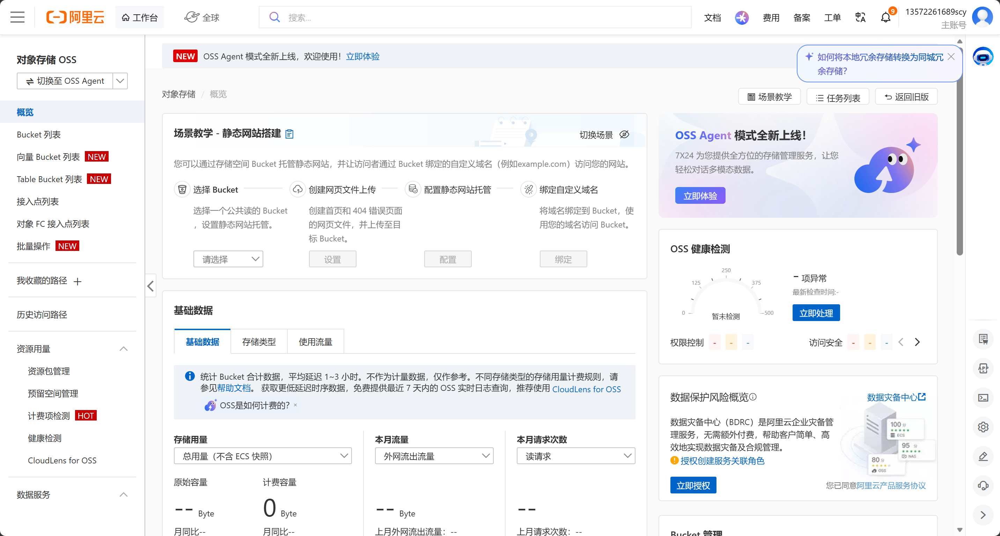
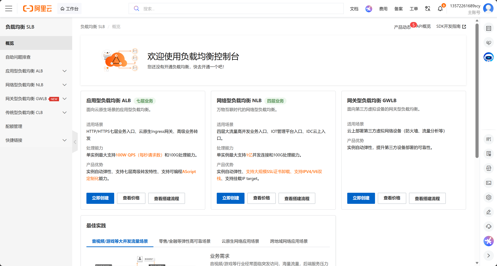

# 阿里云运维实操笔记 · Day1 云产品组件认知
## 基础环境信息
- ECS地域：西南1（成都）
- 实例系统：CentOS 7.9 64位
- 实例公网IP：47.109.98.44
- 学习环境：本地VMware CentOS7虚拟机 + 阿里云ECS云服务器

## 1. ECS云服务器

### 功能说明
ECS是阿里云提供的云端虚拟主机，放置在机房24小时在线，拥有独立公网IP，可对外提供服务；
本地VM虚拟机仅本机可访问，关机即停止，二者Linux命令完全通用。
### 控制台可操作功能
启停实例、重置root密码、查看CPU/内存磁盘监控、远程连接、配置网络。

## 2. 安全组（云上外层防火墙）

### 功能说明
云服务器第一道流量防火墙，分为**入方向（外部访问服务器）、出方向（服务器向外访问）**；
外网SSH、网页访问必须先在安全组放行对应端口，否则无法连通。
今日仅浏览规则，Day2实操新增端口放行。

## 3. VPC私有网络

### 功能说明
独立隔离内网环境，同一VPC下多台ECS可内网互通；不同VPC网络完全隔离，提升内网数据安全。

## 4. 快照/块存储备份

### 功能说明
对系统云盘做整机备份，系统崩溃、文件误删时，可回滚快照恢复全部数据；
入口在ECS左侧「块存储」菜单，Day3实操创建快照+回滚测试。

## 5. OSS对象存储

### 功能说明
云端文件存储服务，存放部署包、业务日志、静态资源，不占用ECS本地磁盘；
Bucket是OSS独立存储空间，Day4实操创建Bucket、上传文件。

## 6. SLB负载均衡（仅概念了解，不创建实例）

### 功能说明
多台ECS集群前端流量分发工具，自动分摊用户访问请求，自动剔除宕机故障服务器，避免业务单点故障。

## 今日学习小结
1. 本地VM虚拟机与阿里云ECS系统内核一致，Linux命令互通，区别在于ECS拥有公网、多层云防火墙、云端备份能力；
2. 免费按量ECS闲置时建议停机，减少免费额度消耗；
3. 云资源访问链路：外网 → 安全组 → Linux系统防火墙firewalld → 服务端口，两层防火墙都要放行才能正常访问
