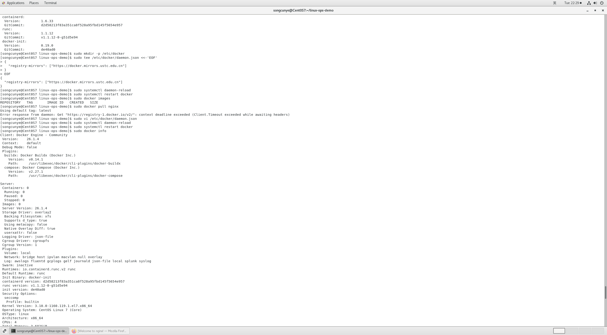
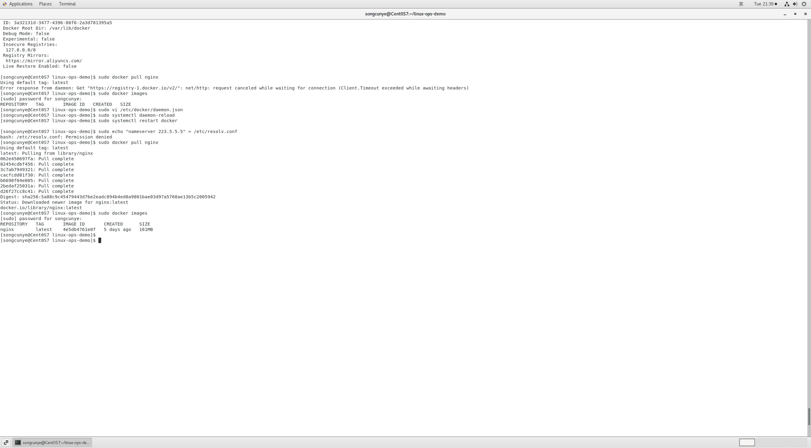
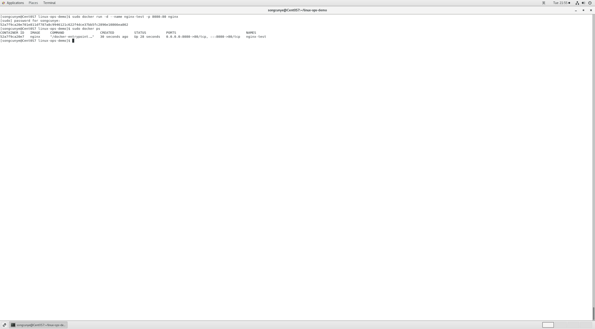
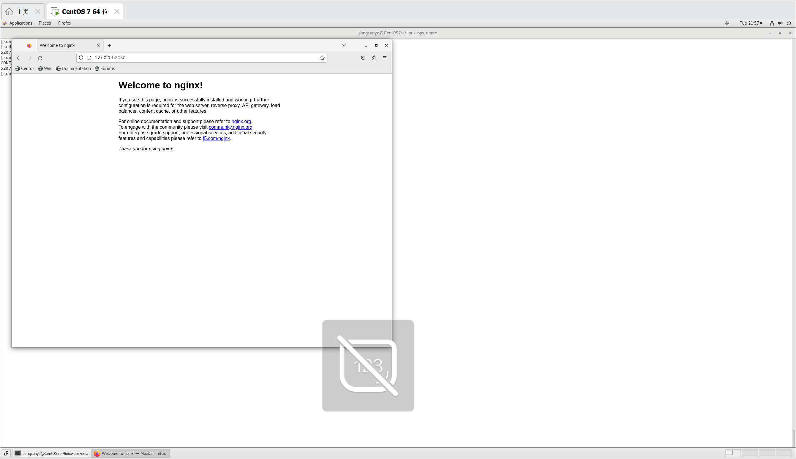
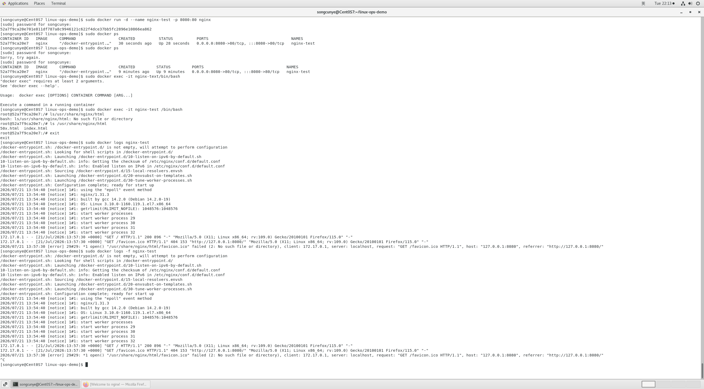
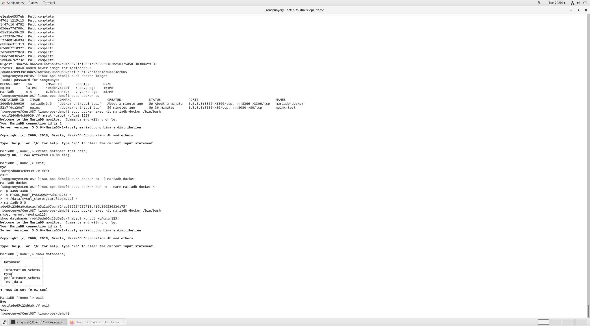

# Docker容器运维实操笔记
运行环境：CentOS7 + Docker 26.1.4

## 一、Docker环境部署
### 1. 环境安装
卸载旧版本依赖，使用阿里云yum源安装docker-ce，安装完成执行：
```bash
sudo docker version
```
同时出现Client、Server代表程序安装完成。

### 2. 配置国内镜像加速（解决拉取超时）
```bash
sudo mkdir -p /etc/docker
sudo tee /etc/docker/daemon.json <<-'EOF'
{
"registry-mirrors": [
"https://dockerproxy.com",
"https://docker.1panel.live",
"https://mirror.baidubce.com"
]
}
EOF
sudo systemctl daemon-reload
sudo systemctl restart docker
```
配置DNS解析：
```bash
sudo echo "nameserver 223.5.5.5" > /etc/resolv.conf
```
验证配置：
```bash
sudo docker info
```


## 二、镜像管理操作（镜像=只读软件包）
### 1. 拉取官方镜像
```bash
#拉取nginx最新镜像
sudo docker pull nginx
#指定版本下载数据库镜像（企业禁止使用latest）
sudo docker pull mariadb:5.5
```

### 2. 查看本地镜像
```bash
sudo docker images
```


### 3. 删除无用镜像
```bash
sudo docker rmi 镜像ID
```

## 三、Nginx容器部署实操
### 1. 启动容器（核心run命令）
参数解释：`-d后台运行 --name命名 -p宿主机端口:容器内部端口`
```bash
sudo docker run -d --name nginx-test -p 8080:80 nginx
```

### 2. 查看运行状态
```bash
sudo docker ps
```
容器状态为Up代表启动成功。


### 3. 访问测试
虚拟机浏览器打开：`127.0.0.1:8080`
出现Nginx默认欢迎页面即部署完成。


## 四、容器日常运维命令（运维必用）
### 1. 启停管理
```bash
#停止容器
sudo docker stop nginx-test
#重启容器
sudo docker restart nginx-test
#查看全部容器（含已停止）
sudo docker ps -a
#删除容器（必须先停止）
sudo docker rm 容器名
```

### 2. 排错：查看运行日志
```bash
#查看全部日志
sudo docker logs nginx-test
#实时滚动监控日志
sudo docker logs -f nginx-test
#Ctrl+C退出监控
```

### 3. 进入容器内部排查、修改配置
```bash
sudo docker exec -it nginx-test /bin/bash
#exit命令退出容器回到宿主机
```


## 五、数据持久化（Docker最重要知识点）
容器本身是临时环境，容器删除内部数据全部清空，`-v`目录挂载将数据永久存放在宿主机磁盘。

### 部署带挂载的MariaDB数据库
```bash
sudo docker run -d --name mariadb-docker \
-p 3306:3306 \
-e MYSQL_ROOT_PASSWORD=Admin123! \
-v /data/mysql_store:/var/lib/mysql \
mariadb:5.5
```
参数说明：
- `-e`：设置数据库root账号密码
- `-v 宿主机目录:容器目录`：实现数据永久保存

### 验证持久化效果
1.容器内创建测试库
2.直接删除容器
3.重新新建容器并挂载同一个目录
4.之前的数据依然保留，不会丢失


## 六、学习总结
1. 镜像属于静态文件，运行之后才叫容器；一个镜像可以启动无数个隔离容器
2. `-p`端口映射：左边是虚拟机对外入口，右边是容器内程序固定端口
3. 所有生产容器必须做数据挂载，绝对不能把重要数据放在容器内部
4. 日常排查优先看logs日志，修改配置使用exec进入容器操作

## 七、实操截图目录
1. docker加速配置：img/docker-info.png
2. 本地镜像列表：img/docker-images.png
3. Nginx容器运行状态：img/nginx-ps.png
4. Nginx网页访问页面：img/nginx-web.png
5. 进入容器+日志查看：img/docker-exec-logs.png
6. MariaDB挂载容器启动：img/mariadb-run.png

