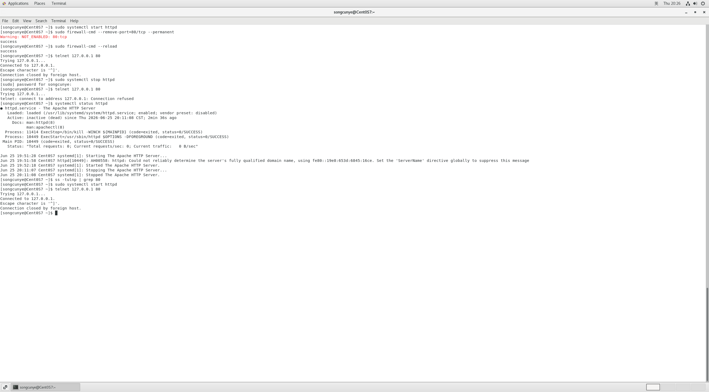

# day4-两类经典运维故障排查.md（完整可直接复制使用）
## 一、项目说明
本次模拟线上两类最高频故障：文件权限拒绝、端口连接被拒绝。

## 故障一：文件权限不足 Permission denied
### 1. 故障复现操作
```bash
# 1. 创建测试文件
touch test.txt
# 2. 修改文件归属为root用户，制造权限锁
sudo chown root:root test.txt
# 3. 普通用户写入内容，触发报错
echo "测试日志内容" > test.txt
```
现象：`bash: test.txt: Permission denied`，普通用户无写入权限。

### 2. 标准排查流程
1. 查看文件归属与权限
```bash
ls -l test.txt
```
输出可见文件属主、属组均为root，当前`songcunye`无写入权限。
2. 两种修复方案
方案1（推荐，永久修改归属）
```bash
sudo chown songcunye:songcunye test.txt
```
方案2（临时提权写入）
```bash
sudo echo "测试日志内容" > test.txt
```

### 3. 故障总结
线上日志、配置文件常出现该问题，核心排查顺序：先看`ls -l`归属，再通过`chown`修正文件所有者。
`，服务已停止。


2. 第二步：验证端口监听状态
```bash
ss -tulnp | grep 80
```
无任何输出，代表80端口没有进程监听。

3. 解决方案：重启Web服务
```bash
sudo systemctl start httpd
```

4. 修复验证：端口恢复连通
```bash
telnet 127.0.0.1 80
```


### 3. 踩坑记录
坑1：使用本地回环地址`127.0.0.1`测试防火墙策略无法复现阻断故障
原因：本机回环流量不经过防火墙过滤，无论防火墙是否放行端口，本地访问永远连通。
优化方案：模拟端口故障优先使用**停止服务**的方式，稳定复现`Connection refused`报错。

坑2：执行防火墙移除端口提示`NOT_ENABLED: 80:tcp`
原因：防火墙原本就没有开放80端口，移除命令无实际效果，不影响本次端口故障模拟。

### 4. 故障总结
出现`Connection refused`报错固定排查顺序：
1. 确认对应服务是否正常运行 `systemctl status xxx`
2. 确认端口是否被进程监听 `ss -tulnp | grep 端口号`
3. 修复启动服务后复测端口连通性


