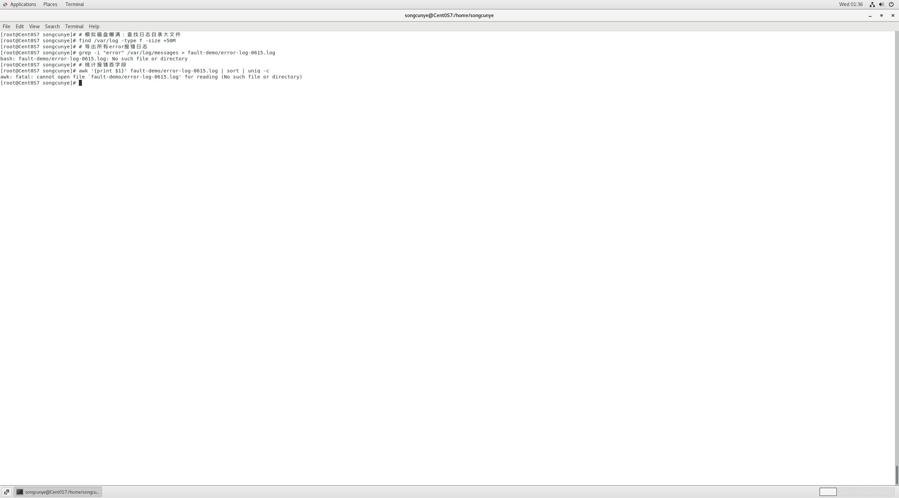

# 故障模拟：服务器磁盘爆满 + 日志报错批量处理
模拟时间：2026-06-15
执行权限：root管理员

## 模拟故障场景
线上服务器磁盘占用过高，系统日志堆积大量error报错，需要完成：定位大日志文件、导出全部报错日志、统计异常访问字段、批量修改日志标记关键词。

## 完整排障操作流程
### 1. 创建故障文件存放目录
```bash
mkdir -p fault-demo
### 故障未建立状态

踩坑记录：未提前创建目标目录，直接使用> 目录/文件重定向输出会提示文件不存在，mkdir -p支持递归创建多层目录，规避该问题。
### 故障处理完成

2. 筛选系统全部 error 日志，导出独立文件
bash
运行
grep -i "error" /var/log/messages > fault-demo/error-log-0615.log
参数 -i：忽略大小写匹配 error 关键词。
3. 统计日志第一列字段（模拟统计客户端访问 IP）
bash
运行
awk '{print $1}' fault-demo/error-log-0615.log | sort | uniq -c
本次实操执行输出：53 Jun，代表日志首字段 Jun 一共出现 53 次。
4. 批量替换日志内 error 关键词为 warn
bash
运行
sed -i 's/error/warn/g' fault-demo/error-log-0615.log
模拟实操收获
完整掌握线上服务器磁盘清理、日志筛选、访问量统计一套排障流程，覆盖 find/grep/sed/awk 全部核心文本处理命令。
