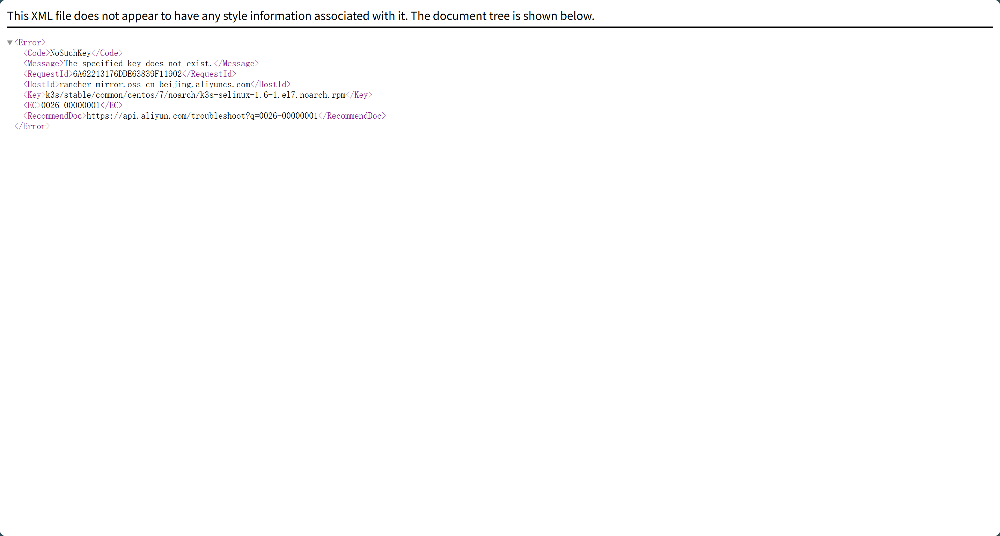
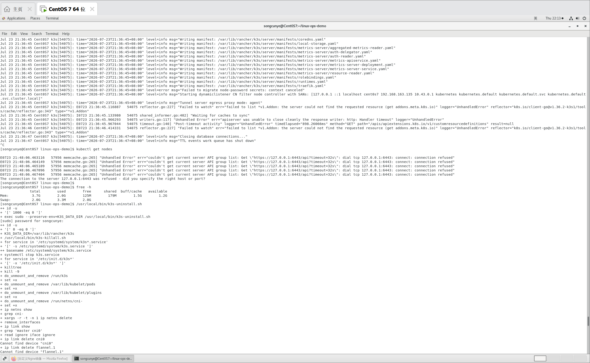
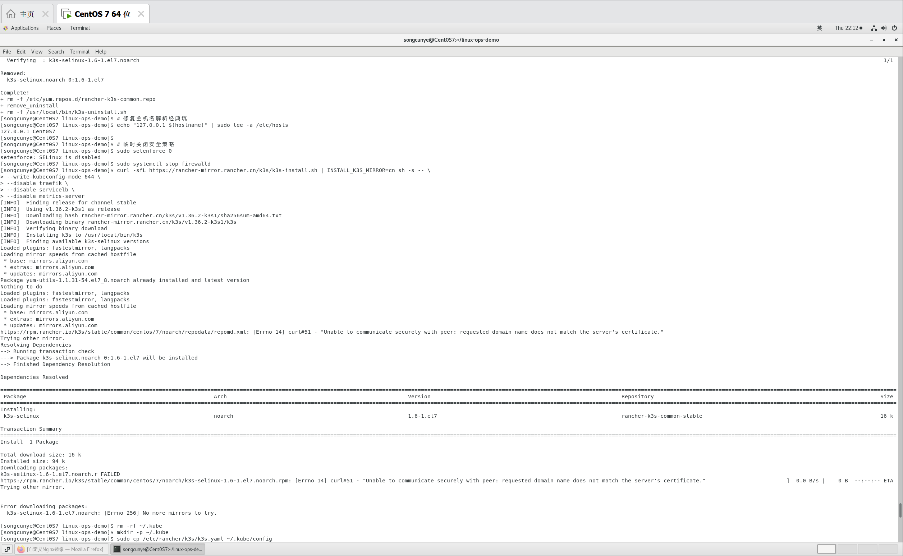

# 第1步：进入项目根目录，创建整套文件夹结构
复制下面整段，直接粘贴虚拟机终端运行
```bash
cd /home/songcunye/linux-ops-demo
mkdir -p k3s-notes/images k3s-notes/k3s-demo
ls
```
执行完你会看到新生成的 `k3s-notes` 文件夹。

> 目录结构预览
```
linux-ops-demo/
├── docker-notes/
└── k3s-notes/
    ├── images/        # 存放你的3张报错截图
    └── k3s-demo/      # 存放部署yaml文件
```

# 第2步：进入k3s-demo，创建第一个yaml
```bash
cd k3s-notes/k3s-demo
vi nginx-deploy.yaml
```
进入vi后，按 `i` 进入编辑模式，粘贴下面内容：
```yaml
apiVersion: apps/v1
kind: Deployment
metadata:
  name: my-nginx
spec:
  replicas: 1
  selector:
    matchLabels:
      app: my-nginx
  template:
    metadata:
      labels:
        app: my-nginx
    spec:
      containers:
      - name: nginx
        image: my-nginx:v1
        ports:
        - containerPort: 80
```
粘贴完成：
按 `Esc` → 输入 `:wq` 回车保存退出。

# 第3步：创建第二个yaml
```bash
vi nginx-svc.yaml
```
按 `i`，粘贴内容：
```yaml
apiVersion: v1
kind: Service
metadata:
  name: my-nginx-svc
spec:
  type: NodePort
  selector:
    app: my-nginx
  ports:
  - port: 80
    targetPort: 80
    nodePort: 30083
```
`Esc` → `:wq` 保存退出。

# 第4步：回到k3s-notes目录，新建主文档
```bash
cd ../
vi K3s轻量Kubernetes集群实战部署.md
```
按 `i`，**完整粘贴下面整篇文档**
```markdown
# K3s轻量Kubernetes集群实战部署
## 目录
1. [K8s与K3s基础概念](#1-k8s与k3s基础概念)
2. [Docker Compose vs Kubernetes 核心差异](#2-docker-compose-vs-kubernetes-核心差异)
3. [K3s集群安装方案](#3-k3s集群安装方案)
4. [K8s核心资源说明](#4-k8s核心资源说明)
5. [自定义Nginx镜像K8s部署方案](#5-自定义nginx镜像k8s部署方案)
6. [常用kubectl命令清单](#6-常用kubectl命令清单)
7. [CentOS7虚拟机部署全程故障汇总（本次实操踩坑）](#7-centos7虚拟机部署全程故障汇总本次实操踩坑)
8. [面试核心考点](#8-面试核心考点)

---
## 1. K8s与K3s基础概念
### 1.1 Kubernetes(K8s)
容器编排平台，用于大规模管理容器，提供**故障自愈、弹性扩缩容、滚动更新、服务发现、负载均衡**企业级能力。

### 1.2 K3s
Rancher推出的轻量级Kubernetes发行版，剔除冗余组件、降低资源开销，适合单机、边缘设备、学习环境使用。

### 1.3 核心资源名词
- **Node**：集群节点，运行容器的服务器；
- **Pod**：K8s最小调度单元，一组共享网络/存储的容器；
- **Deployment**：无状态应用控制器，管理Pod创建、重启、扩缩容；
- **Service**：为Pod提供固定访问入口，实现负载均衡；
- **yaml资源清单**：声明式定义集群资源，类似Docker Compose配置文件。

### 1.4 业务流转流程
自制镜像 → 打包运行Pod → Deployment管控Pod生命周期 → Service对外暴露访问

---
## 2. Docker Compose vs Kubernetes 核心差异
| 工具 | 使用场景 | 集群支持 | 自愈/扩缩容 |
|------|---------|----------|------------|
| Docker Compose | **单机本地多容器编排** | 不支持多机器集群 | 无原生高级能力 |
| K8s/K3s | 分布式容器编排 | 支持多节点集群 | 支持自愈、弹性伸缩、灰度发布 |

> 通俗理解：Compose适合开发本地调试；K8s用于生产环境容器集群管理。

---
## 3. K3s集群安装方案
### 3.1 推荐轻量化安装命令（国内镜像，关闭多余组件降低内存占用）
```bash
curl -sfL https://rancher-mirror.rancher.cn/k3s/k3s-install.sh | INSTALL_K3S_MIRROR=cn sh -s -- \
--write-kubeconfig-mode 644 \
--disable traefik \
--disable servicelb \
--disable metrics-server \
--selinux false
```
参数说明：
- `--write-kubeconfig-mode 644`：配置文件权限适配普通用户；
- `--disable xxx`：关闭Ingress、负载均衡、监控组件，减少内存消耗；
- `--selinux false`：关闭selinux依赖校验。

### 3.2 普通用户权限配置（安装完成后执行）
```bash
rm -rf ~/.kube
mkdir -p ~/.kube
sudo cp /etc/rancher/k3s/k3s.yaml ~/.kube/config
sudo chown $USER:$USER ~/.kube/config
# 永久环境变量
echo 'export KUBECONFIG=$HOME/.kube/config' >> ~/.bashrc
source ~/.bashrc
```

### 3.3 集群验证命令
```bash
kubectl get nodes
kubectl get pods -n kube-system
```

### 3.4 卸载重置集群
```bash
/usr/local/bin/k3s-uninstall.sh
```

> ⚠️ 重要注意事项
> 1. 虚拟机建议空闲内存 ≥2GB；内存不足会导致集群初始化卡死；
> 2. 安装启动后等待2~3分钟初始化，不要频繁重启服务；
> 3. 重装集群后旧kube配置文件失效，必须重新拷贝配置。

---
## 4. K8s核心资源操作通用语法
```bash
# 创建/更新资源
kubectl apply -f xxx.yaml
# 删除资源
kubectl delete -f xxx.yaml
# 查看资源
kubectl get pod/deploy/svc/node
# 查看资源详细信息（排错）
kubectl describe pod pod名称
# 查看容器日志
kubectl logs -f pod名称
# 进入容器终端
kubectl exec -it pod名称 -- /bin/bash
```
简写：
`deployment` → `deploy`；`service` → `svc`

### 命名空间Namespace
用于集群资源隔离，默认使用default命名空间
```bash
kubectl get ns
kubectl create ns dev
```

---
## 5. 自定义Nginx镜像K8s部署方案
> 使用上一阶段Docker构建镜像 `my-nginx:v1`

### 目录结构
```
k3s-demo/
├── nginx-deploy.yaml
└── nginx-svc.yaml
```

#### nginx-deploy.yaml
```yaml
apiVersion: apps/v1
kind: Deployment
metadata:
  name: my-nginx
spec:
  replicas: 1
  selector:
    matchLabels:
      app: my-nginx
  template:
    metadata:
      labels:
        app: my-nginx
    spec:
      containers:
      - name: nginx
        image: my-nginx:v1
        ports:
        - containerPort: 80
```

#### nginx-svc.yaml
```yaml
apiVersion: v1
kind: Service
metadata:
  name: my-nginx-svc
spec:
  type: NodePort
  selector:
    app: my-nginx
  ports:
  - port: 80
    targetPort: 80
    nodePort: 30083
```

### 部署执行命令
```bash
cd k3s-demo
kubectl apply -f nginx-deploy.yaml
kubectl apply -f nginx-svc.yaml
# 查看运行状态
kubectl get deploy,pod,svc
```

### 访问地址
`虚拟机IP:30083`

### 扩缩容测试
```bash
# 扩容至3副本
kubectl scale deploy my-nginx --replicas=3
# 缩容至1副本
kubectl scale deploy my-nginx --replicas=1
```

---
## 6. 常用kubectl命令清单
```bash
kubectl get nodes                     # 查看集群节点
kubectl get pods -n kube-system       # 查看集群系统组件
kubectl get pods                      # 查看默认命名空间Pod
kubectl get deploy                    # 查看Deployment
kubectl get svc                       # 查看Service

kubectl logs -f <pod名称>             # 实时日志
kubectl exec -it <pod名称> -- /bin/bash # 进入容器
kubectl delete -f .                   # 删除当前目录所有yaml资源
```

---
## 7. CentOS7虚拟机部署全程故障汇总（本次实操踩坑）
> 环境：CentOS7 2G内存虚拟机
### 故障1：Rancher yum源下载k3s-selinux失败
报错：`curl#51 证书域名不匹配` / `No more mirrors to try`
原因：国内镜像源OSS文件已移除`k3s-selinux-1.6-1.el7.noarch.rpm`，yum依赖无法下载，安装流程中断。
方案：安装脚本增加 `--selinux false` 关闭selinux依赖校验。




### 故障2：tls证书未知权威报错
报错：`tls: failed to verify certificate x509 unknown authority`
原因：重装k3s集群会重新生成TLS证书，旧`~/.kube/config`缓存旧证书失效。
解决：删除`~/.kube`目录，重新拷贝全新 `/etc/rancher/k3s/k3s.yaml`。

### 故障3：connect refused 127.0.0.1:6443
诱因分为3种：
1. k3s正在初始化，等待2~3分钟重试；
2. **虚拟机可用内存不足**，APIServer进程无法正常启动；
3. 主机名无法解析，需要写入 `/etc/hosts`：`127.0.0.1 $(hostname)`。



### 故障4：k3s日志持续刷屏，长时间无法就绪
优化手段：
1. 不要频繁重启k3s打断初始化；
2. 临时关闭firewalld、SELinux；
3. 内存不足属于硬件瓶颈，低配虚拟机无法稳定运行完整集群。

> 总结：CentOS7 2G内存虚拟机受【内存不足+外网镜像源失效】双重限制，无法完整跑通K3s集群实操；代码、yaml、文档全部留存，更换内存充足云服务器环境即可复现部署流程。

---
## 8. 面试核心考点
1. Pod和容器的关系？
2. Deployment作用是什么？
3. Service类型NodePort工作原理？
4. K3s对比原生K8s优势、适用场景？
5. K8s常见异常Pod状态（ImagePullBackOff、CrashLoopBackOff）排查思路？
6. Docker Compose 和 K8s使用场景区别？

