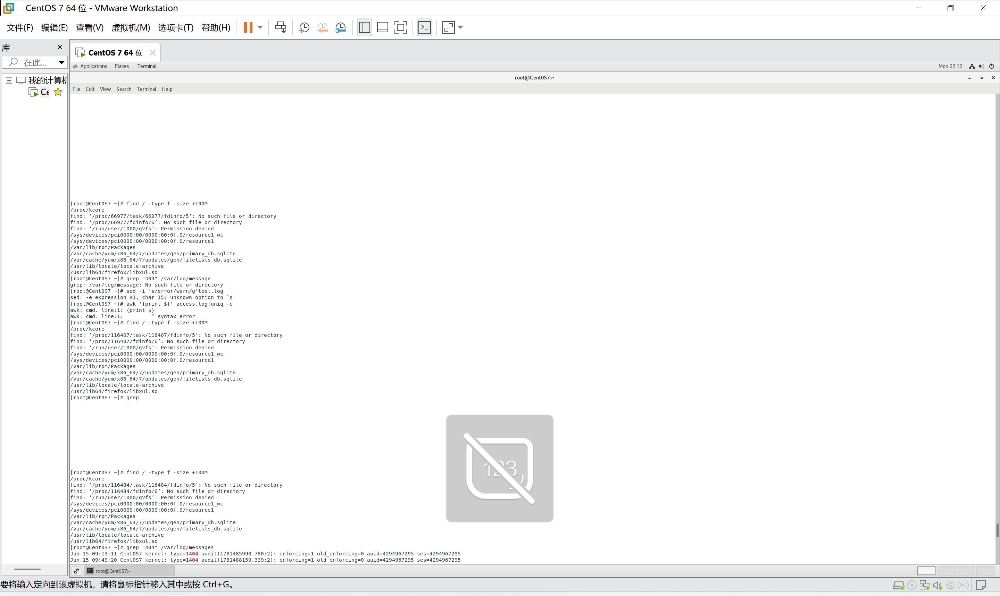
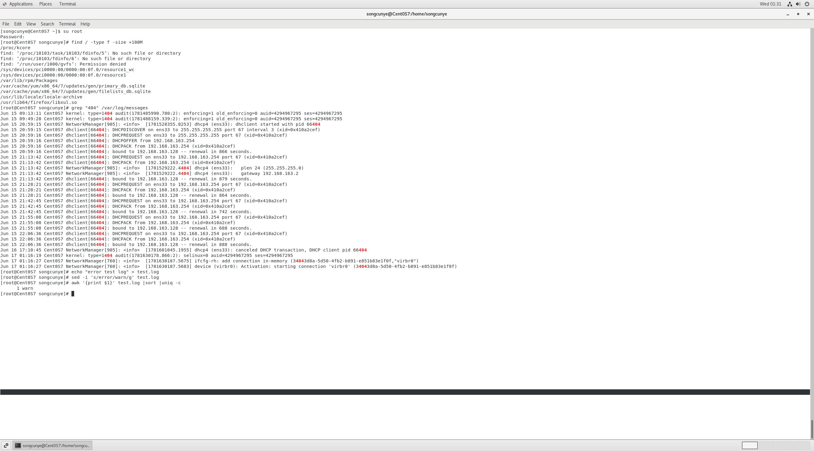

# Day1 文件检索&文本处理命令（find/grep/sed/awk）
学习日期：2026-06-15
实操环境：CentOS7 虚拟机 root管理员

## 一、find 磁盘大文件检索
### 执行命令
```bash
find / -type f -size +100M
参数说明
/：从系统根目录开始递归检索
-type f：只匹配普通文件，过滤文件夹、虚拟设备
+100M：筛选大于 100MB 的文件；去掉 + 代表等于 100M
企业应用场景
服务器磁盘空间爆满，快速定位占用空间巨大的日志、安装包、缓存文件。
实操现象说明
/proc/* No such file or directory：/proc 是内核虚拟文件系统，临时文件可直接忽略；
少量Permission denied：系统私有保护目录，root 也无访问权限，不影响正常文件检索结果。
踩坑记录
普通用户执行全盘检索会大量输出权限拒绝报错，解决办法：
su root 切换管理员账号（本次实操使用）
sudo find / -type f -size +100M 临时提升权限
二、grep 日志关键词过滤
执行命令
bash
运行
grep "404" /var/log/messages
grep -i "error" /var/log/messages
参数说明
基础用法：匹配日志中包含指定字符串的整行日志；
-i：忽略英文字母大小写匹配。
企业应用场景
线上服务器排查接口报错、服务异常、非法访问记录，快速过滤关键日志。
实操结果
本次过滤 404 无匹配日志，输出大量 dhclient 客户端自动分配 IP 记录，代表虚拟机网络 DHCP 服务运行正常。
三、sed 文本全局替换
完整实操流程
bash
运行
# 创建测试日志文件
echo "error test log" > test.log
# 全局替换error为warn，直接修改原文件
sed -i 's/error/warn/g' test.log
# 查看替换结果
cat test.log
参数说明
-i：直接修改源文件，生产环境修改配置前务必备份原文件；
s/旧内容/新内容/g：全局匹配替换，g 代表一行内全部替换。
踩坑记录
sed 表达式与目标文件之间缺少空格，会报unknown option语法错误；
目标文件不存在时，提示No such file or directory。
### sed报错演示

四、awk 日志字段统计（面试高频：IP 访问量统计）
标准统计组合命令
bash
运行
awk '{print $1}' test.log | sort | uniq -c
管道分步拆解
awk '{print $1}'：以空格分割文本，提取每行第一个字段（网站访问日志一般存放客户端 IP）；
sort：对提取的字段进行排序；
uniq -c：统计重复内容出现次数，输出格式：次数 对应内容。
实操输出示例
文件内容warn test log，执行后输出 1 warn，代表首字段 warn 仅出现 1 次。
### awk报错演示

企业用途
统计网站各客户端 IP 访问频次，快速识别恶意爬虫、高频攻击 IP。
权限问题总结
普通用户读取系统日志、检索根目录文件会触发Permission denied权限拒绝报错。
两种标准解决方案：
su root 切换完整管理员权限；
sudo 命令 单次临时提升执行权限。
### 命令执行成功

