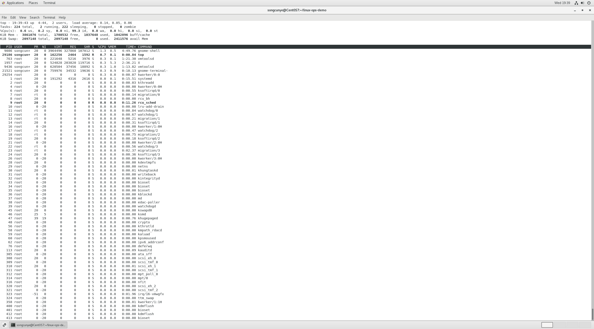
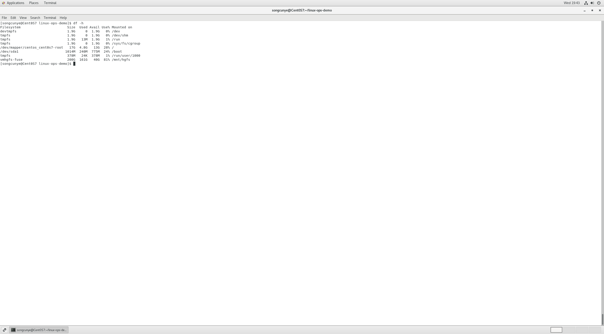
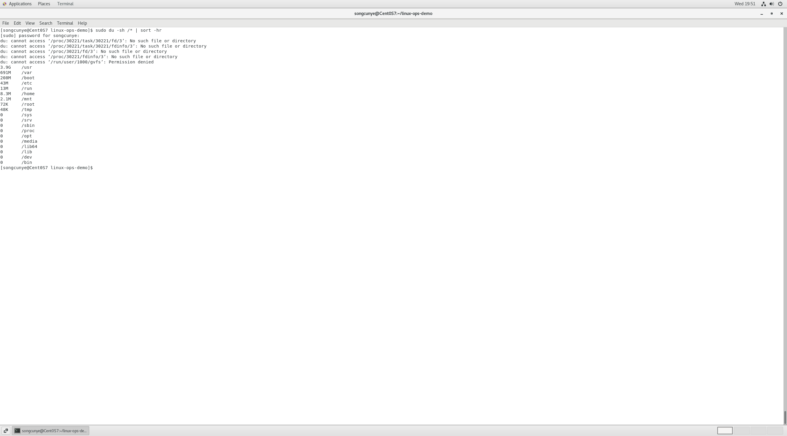
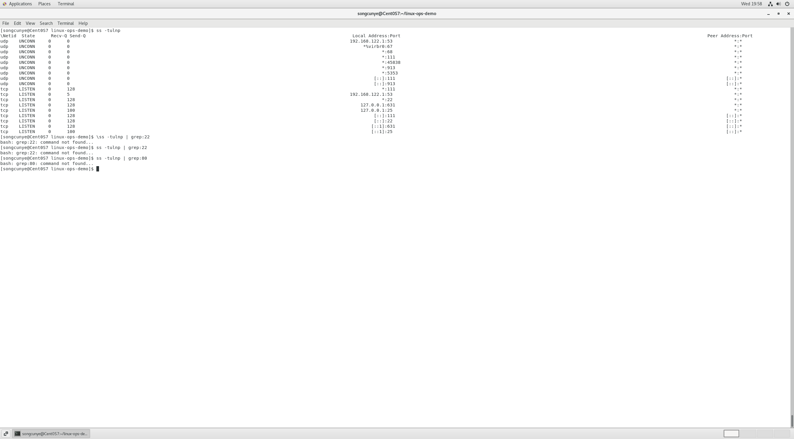
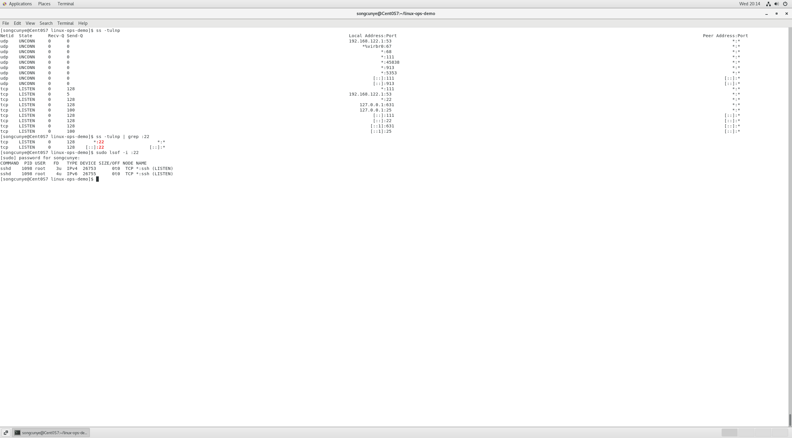

y2 系统资源排查命令 top、df、du、ss、lsof
学习日期：2026-06-17
实操环境：CentOS7 虚拟机 root权限实操

## 一、top 命令：进程CPU/内存实时监控
### 基础执行
```bash
### top按CPU排序截图

top
核心字段解读
%CPU：进程 CPU 占用百分比
%MEM：进程物理内存占用百分比
PID：进程唯一 ID，kill 杀进程需要
COMMAND：进程启动命令 / 程序名
实操任务：找出 CPU 占用最高进程
打开 top 界面，按 P 大写，自动按 CPU 占用从高到低排序
界面第一行进程就是当前 CPU 负载最高程序
按 M 大写，切换为内存占用排序
按 q 退出 top 监控界面
常用拓展参数
bash
运行
# 只监控指定PID进程
top -p 1234
# 每2秒刷新一次（默认3秒）
top -d 2
踩坑记录
普通用户执行 top 只能查看自身进程，系统内核进程需要 sudo 提权查看完整信息。
二、df 命令：磁盘分区整体占用排查
基础命令
bash
运行
# -h 人性化单位展示GB/MB
df -h

输出字段说明
Filesystem：磁盘分区设备名
Size：分区总容量
Used：已使用空间
Avail：剩余可用空间
Use%：磁盘使用率（线上预警阈值 85%）
Mounted on：分区挂载目录
企业场景
服务器磁盘爆满告警，先用 df -h 快速定位哪个分区满了。
三、du 命令：目录 / 文件空间细分统计
df 看整体分区，du 看单个文件夹占用大小，二者搭配使用
bash
运行
# 查看当前目录下各文件夹占用，人性化单位，按大小排序
du -sh * | sort -hr

参数解释
-s：只展示总大小，不递归输出子文件
-h：人类可读单位
sort -hr：从大到小排序，一眼找到占用最大文件夹

完整排障流程
df -h 发现 / 根分区使用率 100%
cd / 进入根目录
du -sh * | sort -hr 找出占用最大目录（一般是日志 / 安装包）
四、ss 命令：端口占用查询（netstat 替代品，更快）
1、查看本机所有监听端口
bash
运行
ss -tulnp

参数：
-t：TCP 端口
-u：UDP 端口
-l：监听中的服务端口
-n：不解析域名，直接显示数字端口
-p：显示占用端口的进程 PID / 程序名
实操任务：查询 80、22 端口占用
bash
运行
# 精准过滤22端口
ss -tulnp | grep :22
# 过滤80端口
ss -tulnp | grep :80
五、lsof 命令：文件 / 端口占用溯源
1、查看哪个进程占用指定端口
bash
运行
lsof -i :22
lsof -i :80

2、查看哪个进程占用某个文件（磁盘无法卸载排障）
bash
运行
lsof /var/log/messages
3、查看用户所有进程打开文件
bash
运行
lsof -u root

Day2 综合实操排障模拟
故障场景：服务器卡顿、磁盘满、端口冲突
用 top 找到 CPU 占用异常进程，记录 PID
df -h 确认磁盘分区占用率
du -sh /* | sort -hr 定位大文件目录
ss -tulnp / lsof -i 排查端口占用冲突
高占用无用进程执行 kill -9 PID 释放资源
Day2 踩坑总结
ss/lsof 查看进程名需要 sudo，普通用户看不到 PID；
du 不加 - s 会递归打印全部子文件，输出刷屏；
top 界面小写 p 和大写 P 区分，大写 P 才是 CPU 排序；
df 统计包含系统预留空间，du 统计纯用户文件，数值会有微小差值。
明日预习 Day3
Shell 基础变量、循环判断、简单运维自动化脚本编写。
plaintext

