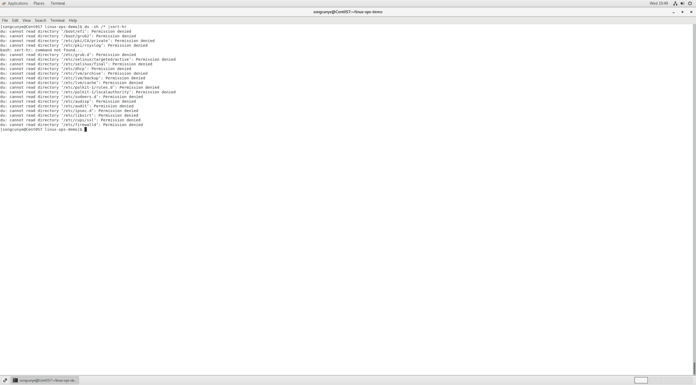
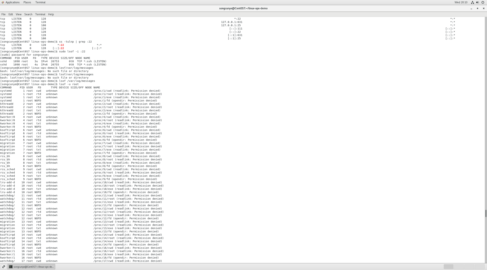

# Day2 系统资源排查命令 top、df、du、ss、lsof
学习日期：2026-06-17
实操环境：CentOS7 虚拟机，root权限实操

## 一、top 命令：进程CPU/内存实时监控
### 基础执行
```bash
top
```


### 核心字段解读
- `%CPU`：进程 CPU 占用百分比
- `%MEM`：进程物理内存占用百分比
- `PID`：进程唯一 ID，杀进程时使用
- `COMMAND`：进程启动命令 / 程序名

### 实操交互快捷键
1. 大写 `P`：按 CPU 占用从高到低排序，第一行为当前负载最高进程
2. 大写 `M`：切换为内存占用排序
3. `q`：退出 top 监控界面

### 常用拓展参数
```bash
# 只监控指定PID进程
top -p 1234
# 每2秒刷新一次（默认3秒刷新）
top -d 2
```

### 踩坑记录
普通用户执行 top 仅能查看自身进程，查看系统内核进程需 `sudo` 提权获取完整信息。

---

## 二、df 命令：磁盘分区整体占用排查
### 基础命令
```bash
# -h 人性化单位展示GB/MB
df -h
```


### 输出字段说明
- `Filesystem`：磁盘分区设备名
- `Size`：分区总容量
- `Used`：已使用空间
- `Avail`：剩余可用空间
- `Use%`：磁盘使用率（线上预警阈值 85%）
- `Mounted on`：分区挂载目录

### 企业应用场景
服务器磁盘爆满告警，先用 `df -h` 快速定位高占用分区。

---

## 三、du 命令：目录 / 文件空间细分统计
> 区别：df 查看分区整体容量，du 统计单个文件夹实际占用大小，二者搭配排查磁盘爆满

### 基础命令
```bash
# 查看当前目录下各文件夹占用，人性化单位，从大到小排序
du -sh * | sort -hr
```



### 参数解释
- `-s`：只展示目录总大小，不递归打印所有子文件
- `-h`：以人类可读单位（M/G）展示
- `sort -hr`：按容量从大到小倒序，快速定位大目录

### 完整磁盘爆满排障流程
1. `df -h` 发现 `/` 根分区使用率100%
2. `cd /` 进入根目录
3. `du -sh /* | sort -hr` 定位占用最大目录（多为日志、安装包缓存）

---

## 四、ss 命令：端口占用查询（netstat 高性能替代品）
### 1. 查看本机所有监听端口
```bash
ss -tulnp
```


### 参数说明
- `-t`：筛选TCP端口
- `-u`：筛选UDP端口
- `-l`：仅展示监听状态服务端口
- `-n`：不解析域名，直接显示数字端口
- `-p`：显示占用端口的进程PID与程序名

### 实操任务：精准查询指定端口占用
```bash
# 过滤22ssh端口
ss -tulnp | grep :22
# 过滤80web端口
ss -tulnp | grep :80
```

---

## 五、lsof 命令：文件 / 端口占用溯源
### 1. 查看占用指定端口的进程
```bash
lsof -i :22
lsof -i :80
```


### 2. 查看占用指定文件的进程（磁盘无法卸载场景排障）
```bash
lsof /var/log/messages
```

### 3. 查看root用户所有进程打开的文件句柄
```bash
lsof -u root
```


---

# Day2 综合实操排障模拟
故障场景：服务器卡顿、磁盘爆满、端口冲突排查完整流程
1. 使用 `top` 定位CPU占用异常进程，记录PID
2. `df -h` 查看各磁盘分区占用率
3. `du -sh /* | sort -hr` 定位超大文件/目录
4. `ss -tulnp` / `lsof -i` 排查端口冲突、端口占用进程
5. 确认无用高占用进程后执行 `kill -9 PID` 释放系统资源

# Day2 踩坑总结
1. `ss` / `lsof` 查看进程PID名称需要root/sudo，普通用户无法展示进程信息；
2. du 不加 `-s` 会递归输出全部子文件，输出刷屏难以查看；
3. top界面大小写快捷键区分：大写`P`为CPU排序，小写p无该功能；
4. df与du统计数值存在微小差值：df包含系统预留空间，du仅统计用户实际文件。
