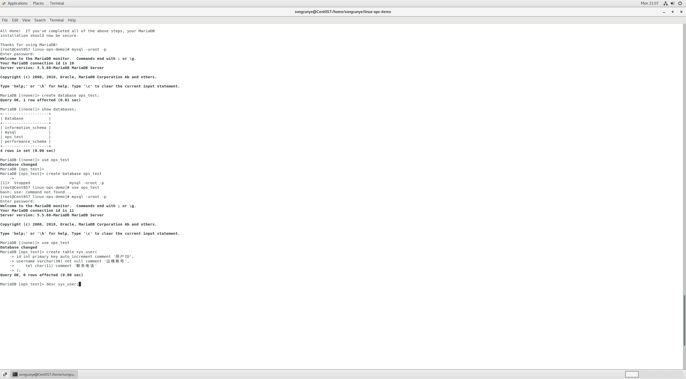
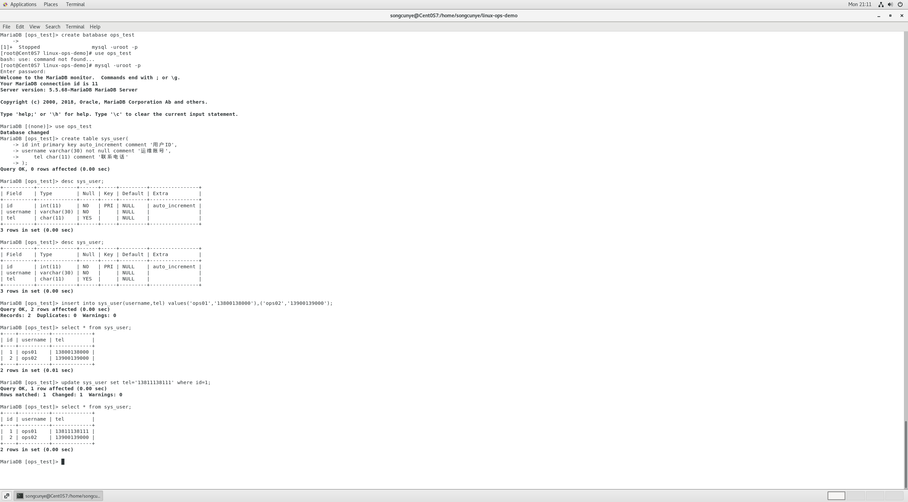
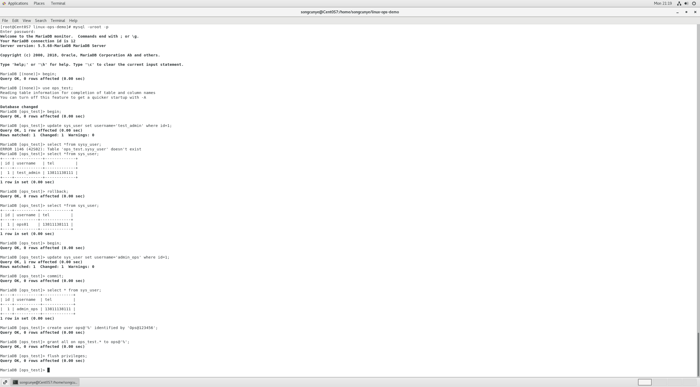

ql-notes/day1-mysql库表CRUD与事务.md 完整成品文档（直接复制进文件使用）
# Day1 MariaDB 库表创建、CRUD、事务实操笔记
## 环境说明
操作环境：CentOS7 虚拟机 MariaDB 5.5.68
配套工具：Windows本地DBeaver可视化验证，数据库远程账号ops，端口3306
学习目标：匹配运维JD数据库要求，掌握库/表管理、增删改查、事务回滚与提交，可完成基础业务数据运维。

## 一、数据库基础操作
### 1. 登录数据库
```bash
# Linux终端登录命令
mysql -uroot -p
```
输入root密码后进入交互终端 `MariaDB [(none)]>`

### 2. 创建运维业务测试库 ops_test
```sql
-- 创建数据库
create database ops_test;
-- 查看全部数据库
show databases;
-- 切换至目标库
use ops_test;
```
执行结果截图说明：
执行`show databases;`后列表中出现`ops_test`，代表库创建成功。

## 二、数据表创建
### 建表SQL（运维用户表sys_user）
```sql
create table sys_user(
    id int primary key auto_increment comment '用户自增主键ID',
    username varchar(30) not null comment '运维人员登录账号',
    tel char(11) comment '联系手机号'
);
-- 查看表结构
desc sys_user;
```
字段说明：
1. `primary key auto_increment`：主键自增，每条数据唯一标识；
2. `varchar(30) not null`：账号不能为空，限制最长30字符；
3. `char(11)`：手机号固定11位字符存储。

## 三、CRUD 增删改查全套实操（面试必考核心）
### 1. 新增数据 insert
```sql
-- 插入2条运维测试账号
insert into sys_user(username,tel) values('ops01','13800138000'),('ops02','13900139000');
-- 查询全表数据
select * from sys_user;
```
执行效果：表内生成2条完整记录。

### 2. 修改数据 update（带条件，避免全表更新）
```sql
-- 修改id=1用户的手机号
update sys_user set tel='13811138111' where id=1;
select * from sys_user;
```
运维规范提醒：update必须搭配where条件，线上环境禁止无条件更新整张表。

### 3. 删除数据 delete（精准删除单条）
```sql
-- 删除id=2的测试账号
delete from sys_user where id=2;
select * from sys_user;
```
运维区分：delete仅删除表内数据；drop table会直接删除整张数据表，生产环境谨慎使用。

## 四、事务 Transaction 实操（JD明确要求掌握事务处理）
### 知识点说明
事务四大特性ACID：原子性、一致性、隔离性、持久性；
核心命令：`begin` 开启事务、`rollback` 回滚撤销所有未提交操作、`commit` 永久提交修改。

### 实操1：事务回滚（撤销修改，数据无变化）
```sql
use ops_test;
-- 1. 开启事务
begin;
-- 2. 修改用户名
update sys_user set username='test_admin' where id=1;
-- 3. 查询临时修改结果
select * from sys_user;
-- 4. 回滚，撤销本次所有修改
rollback;
-- 5. 再次查询，数据恢复原始状态
select * from sys_user;
```
实操结论：rollback后所有update操作失效，数据回到事务开启前状态。

### 实操2：事务提交（永久保存修改）
```sql
-- 开启新事务
begin;
update sys_user set username='admin_ops' where id=1;
select * from sys_user;
-- 提交修改，数据永久写入数据库
commit;
select * from sys_user;
```
运维场景：转账、批量数据更新必须使用事务，防止操作中途异常导致数据错乱。

## 五、配置远程访问账号（对接Windows DBeaver可视化工具）
### 1. 创建远程登录账号ops
```sql
-- % 代表允许任意IP远程连接
create user ops@'%' identified by 'Ops@123456';
-- 赋予ops_test库全部操作权限
grant all on ops_test.* to ops@'%';
-- 刷新权限立即生效
flush privileges;
```
### 2. Linux防火墙放行3306数据库端口（root终端执行）
```bash
firewall-cmd --add-port=3306/tcp --permanent
firewall-cmd --reload
```
### 3. DBeaver连接参数
主机：虚拟机IP地址
端口：3306
数据库：ops_test
用户名：ops
密码：Ops@123456

