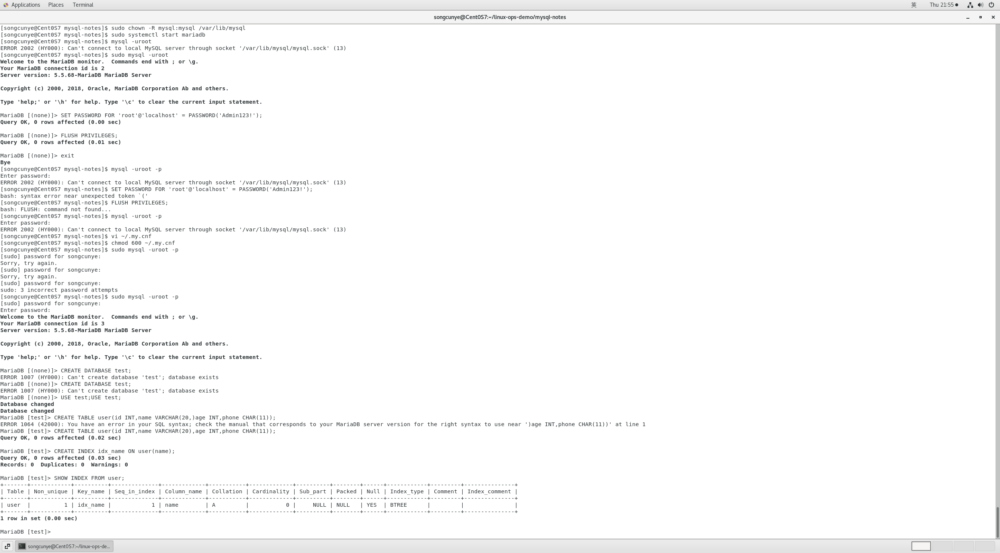
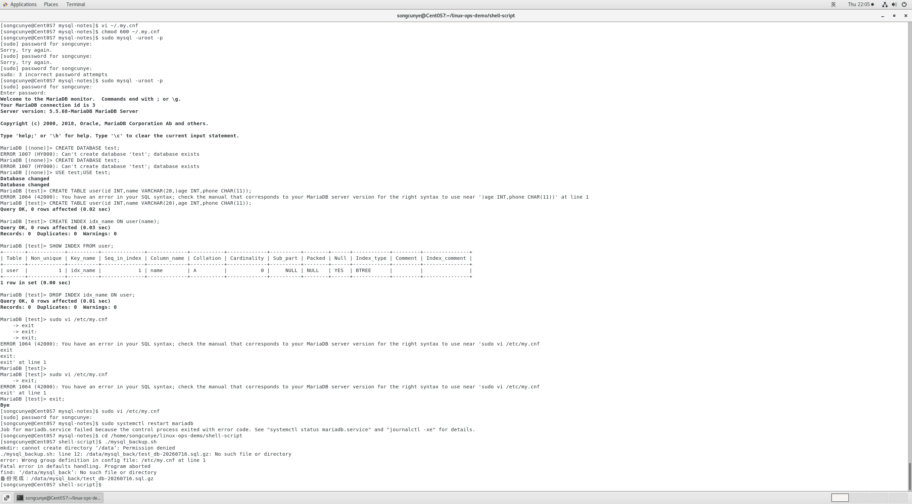

# MySQL进阶优化实操笔记
运行环境：CentOS7 + MySQL5.# MySQL进阶优化实操笔记
运行环境：CentOS7 + MariaDB5.5

## 一、索引管理
### 1.1 索引创建语法
普通索引
```sql
CREATE INDEX idx_name ON user(name);
```
联合索引（多字段查询优先）
```sql
CREATE INDEX idx_name_age ON user(name,age);
```
唯一索引
```sql
CREATE UNIQUE INDEX idx_phone ON user(phone);
```
删除索引
```sql
DROP INDEX idx_name ON user;
```

### 1.2 查看表索引
```sql
SHOW INDEX FROM user;
```


### 1.3 索引失效常见场景
1. 查询条件字段使用函数计算
2. 联合索引不遵循最左匹配原则
3. 字段和数字/字符串隐式转换
4. 使用 `!、not in、or` 未合理建立索引

---

## 二、慢查询日志（定位慢SQL）
### 2.1 临时开启慢查询（重启后失效）
```sql
-- 查看慢查询阈值（默认10秒）
show variables like 'long_query_time';
-- 设置阈值为1秒，超过1秒的SQL记录日志
set global long_query_time=1;
-- 开启慢查询日志
set global slow_query_log=ON;
```

### 2.2 永久配置（/etc/my.cnf）
在`[mysqld]`添加以下配置：
```ini
slow_query_log = 1
slow_query_log_file = /var/log/mariadb/slow.log
long_query_time = 1
log_queries_not_using_indexes = 1 # 记录没走索引的SQL
```
重启数据库生效
```bash
sudo systemctl restart mariadb
```
> 说明：本次慢查询配置操作未留存截图，完整配置参数如上。

### 2.3 查看慢日志
```bash
# 查看全部慢日志
cat /var/log/mariadb/slow.log
# 筛选耗时3秒以上语句
grep 'Query_time: [3-9]' /var/log/mariadb/slow.log
```

---

## 三、数据库备份与恢复（衔接Shell备份脚本）
### 3.1 手动备份（对应mysql_backup.sh原理）
```bash
# 压缩备份
mysqldump -uroot -p test_db | gzip > test_20260714.sql.gz
```

### 3.2 备份包恢复数据库
```bash
# 解压gz备份包
gzip -d test_20260714.sql.gz
# 恢复到数据库
mysql -uroot -p test < test_20260714.sql
```

### 3.3 自动化备份回顾
通过Shell脚本+crontab实现每日凌晨2点自动备份，自动清理7天前备份，防止磁盘溢出。
定时任务配置截图参考 `shell-script/img/crontab-list.png`。

### 3.4 脚本运行截图


---

## 四、实操截图目录
1. 索引查看语句执行截图：`./img/index_test.png`
2. 慢查询日志配置+日志输出截图：无留存，参数见上文配置块
3. 数据库备份脚本操作截图：`./img/mysql_backup_run.png`

## 五、踩坑记录
1. 普通用户直接执行 `mysql -uroot -p` 报 `mysql.sock` 权限拒绝，使用`sudo mysql -uroot -p`提权登录；
2. SQL语句只能在MariaDB命令行内部执行，Linux终端无法直接运行`SET PASSWORD`、`FLUSH PRIVILEGES`等SQL；
3. 修改my.cnf慢查询参数后必须重启mariadb服务配置才会生效。## 1. 索引管理
### 1.1 索引创建语法
# 普通索引
CREATE INDEX idx_name ON user(name);
# 联合索引（多字段查询优先）
CREATE INDEX idx_name_age ON user(name,age);
# 唯一索引
CREATE UNIQUE INDEX idx_phone ON user(phone);
# 删除索引
DROP INDEX idx_name ON user;

### 1.2 查看表索引
SHOW INDEX FROM user;

### 1.3 索引失效常见场景
1. where条件字段使用函数计算
2. 联合索引不遵循最左匹配原则
3. 字段和数字/字符串隐式转换
4. 使用 !=、not in、or 未合理建立索引

## 2. 慢查询日志（定位慢SQL）
### 2.1 临时开启慢查询（重启失效）
# 查看慢查询阈值（默认10秒）
show variables like 'long_query_time';
# 设置阈值为1秒，超过1秒的SQL记录日志
set global long_query_time=1;
# 开启慢查询日志
set global slow_query_log=ON;

### 2.2 永久配置（my.cnf）
vi /etc/my.cnf
# 添加以下配置
slow_query_log = 1
slow_query_log_file = /var/lib/mysql/slow.log
long_query_time = 1
log_queries_not_using_indexes = 1 # 记录没走索引的SQL

# 重启MySQL生效
systemctl restart mysqld

### 2.3 查看慢日志
cat /var/lib/mysql/slow.log
# 筛选耗时3秒以上语句
grep 'Query_time: [3-9]' /var/lib/mysql/slow.log

## 3. 数据库备份与恢复（衔接Shell备份脚本）
### 3.1 手动备份（对应mysql_backup.sh原理）
mysqldump -uroot -p test_db > test.sql
# 压缩备份
mysqldump -uroot -p test_db | gzip > test_20260714.sql.gz

### 3.2 备份包恢复数据库
# 解压gz备份包
gzip -d test_20260714.sql.gz
# 恢复到数据库
mysql -uroot -p test_db < test_20260714.sql

### 3.3 自动化备份回顾
通过Shell脚本+crontab实现每日凌晨2点自动备份，自动清理7天前备份，防止磁盘溢出。
定时任务配置截图参考shell-script/img/crontab-list.png

## 4. 实操截图归档
1. 索引查看语句执行截图：./img/mysql-index.png
2. 慢查询日志配置+日志输出截图：./img/mysql-slow-log.png
3. 数据库备份恢复操作截图：./img/mysql-back-restore.png
