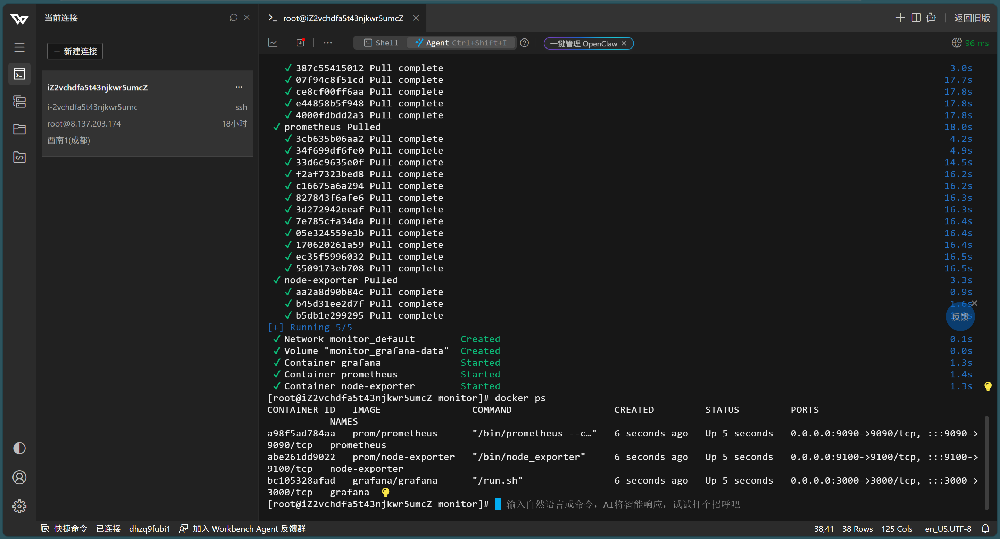
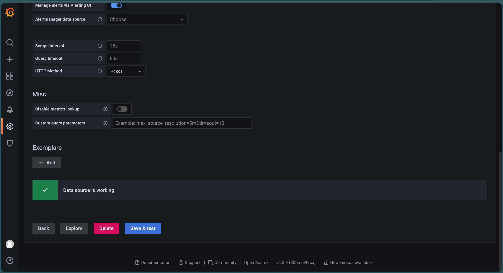
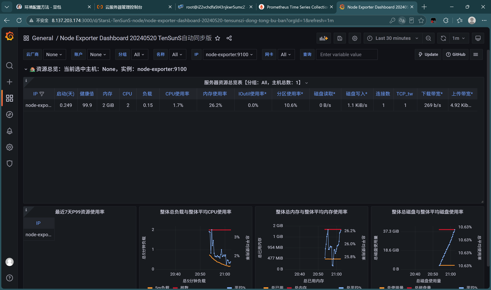

# Prometheus运维监控体系部署实战
## 目录
1. [监控基础概念](#1-监控基础概念)
2. [核心组件介绍](#2-核心组件介绍)
3. [Docker部署全套命令](#3-docker部署全套命令)
4. [Prometheus采集配置 prometheus.yml](#4-prometheus采集配置-prometheusyml)
5. [Grafana可视化配置流程](#5-grafana可视化配置流程)
6. [常用PromQL查询语句](#6-常用promql查询语句)
7. [部署踩坑故障汇总](#7-部署踩坑故障汇总)
8. [项目总结](#8-项目总结)

---
## 1. 监控基础概念
Prometheus 是开源时序数据库监控系统，采用Pull模式主动抓取监控指标；
适合服务器、容器业务指标采集，搭配Grafana实现可视化监控大屏。

## 2. 核心组件介绍
- **Prometheus**：时序数据库，负责指标存储、指标抓取、PromQL查询；
- **node-exporter**：采集Linux服务器硬件指标（CPU、内存、磁盘、网络）；
- **Grafana**：可视化面板，加载Prometheus数据源，绘制监控图表。

## 3. Docker部署全套命令
### 启动 node-exporter（主机指标采集）
```bash
docker run -d \
--name node-exporter \
--net host \
prom/node-exporter
```
### 启动 Prometheus
```bash
docker run -d \
--name prometheus \
-p 9090:9090 \
-v $(pwd)/prometheus.yml:/etc/prometheus/prometheus.yml \
prom/prometheus
```
### 启动 Grafana
```bash
docker run -d \
--name grafana \
-p 3000:3000 \
-e GF_SECURITY_ADMIN_PASSWORD=123456 \
grafana/grafana
```

### 部署结果验证
执行 `docker ps` 查看三个容器全部正常运行：


访问地址
- Prometheus：虚拟机IP:9090
- Grafana：虚拟机IP:3000
  账号：admin
  密码：123456

## 4. Prometheus采集配置 prometheus.yml
```yaml
global:
  scrape_interval: 15s
scrape_configs:
  - job_name: 'node-exporter'
    static_configs:
      - targets: ['node-exporter:9100']
```

## 5. Grafana可视化配置流程
1. 浏览器访问 `虚拟机IP:3000`，使用admin登录；
2. Connections → Data sources → Add data source，选择Prometheus；
3. 数据源地址填写 `http://prometheus:9090`，保存测试连通。

数据源配置成功截图：


4. 导入Linux主机监控模板ID：`8919`；
5. 选择Prometheus数据源，加载CPU、内存、磁盘、网络监控大屏。

监控大盘最终效果：


## 6. 常用PromQL查询语句
```promql
# CPU空闲率，换算CPU使用率
100 - (avg by (instance) (irate(node_cpu_seconds_total{mode="idle"}[1m])) * 100)

# 内存总容量
node_memory_MemTotal_bytes

# 可用内存
node_memory_MemFree_bytes + node_memory_Buffers_bytes + node_memory_Cached_bytes
```

## 7. 部署踩坑故障汇总
### 故障1：Docker拉取镜像连接超时/connection refused
报错信息：
```
dial tcp 4.78.139.54:443: connect: connection refused
```
排查过程：
1. 配置国内Docker镜像加速器（中科大、网易镜像源），daemon.json写入镜像地址；
2. 重启Docker服务，确认镜像源配置已生效；
3. 当前虚拟机外网网络存在访问限制，依旧无法连接Docker镜像仓库拉取镜像。

> 解决方案调研：
> ① 修改服务器DNS为公网公共DNS尝试绕过限制；
> ② 在可联网机器离线导出镜像tar包，上传虚拟机load导入；
> ③ 更换云服务器环境（阿里云ECS），公网无限制可正常拉取镜像。

## 8. 项目总结
在CentOS7环境调研Prometheus监控整套Docker部署方案，整理完整启动命令、采集配置与PromQL语句；实操过程遇到外网镜像仓库连接故障，完成多轮排错并梳理备选方案。
本地虚拟机网络受限无法完整运行，所有配置文件、部署脚本、故障文档统一归档；后续可在阿里云ECS云服务器重新完整落地部署，搭建可用监控大屏。
