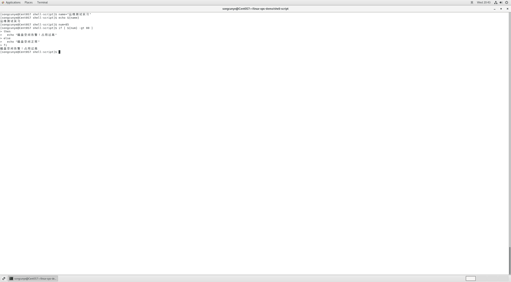
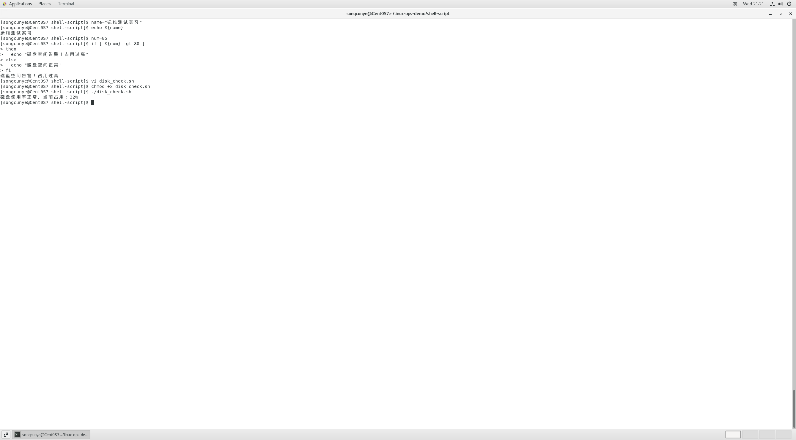
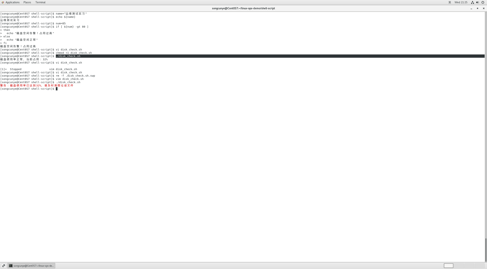

# day3-磁盘监控shell脚本.md
## 一、项目简介
本次编写Linux磁盘使用率自动监控Shell脚本，用于运维日常巡检，当磁盘占用超过阈值时自动输出红色告警信息。可配合定时任务实现服务器无人值守监控，属于运维自动化入门项目。



## 二、脚本完整代码
```bash
#!/bin/bash
# 磁盘使用率监控脚本
# 提取根分区磁盘占用数值，去掉百分号
rate=$(df -h / | grep / | awk '{print $5}' | sed 's/%//g')

# 判断占用是否超出80%阈值
if [ ${rate} -ge 80 ]
then
  echo -e "\033[31m警告：磁盘使用率已达到${rate}%，请及时清理垃圾文件\033[0m"
else
  echo "磁盘使用率正常，当前占用：${rate}%"
fi
```

## 三、操作步骤
1. 创建脚本文件
```bash
vi disk_check.sh
```
按下`i`进入编辑模式，粘贴以上代码，按`Esc`，输入`:wq`保存退出。

2. 赋予脚本可执行权限
```bash
chmod +x disk_check.sh
```

3. 运行脚本
```bash
./disk_check.sh
```

## 四、运行效果图



## 五、拓展优化
可以配置crontab定时任务，让脚本每30分钟自动执行，自动巡检磁盘：
```bash
# 编辑定时任务
crontab -e
# 添加定时规则
*/30 * * * * /home/songcunye/linux-ops-demo/shell-script/disk_check.sh >> /var/log/disk-monitor.log
```

## 六、踩坑记录
1. 问题：执行`chmod`命令提示：No such file or directory
2. 原因：创建文件时文件名拼写错误，脚本文件未生成。
3. 解决方案：严格核对文件名，使用`ls`命令确认文件存在后再执行权限操作。


