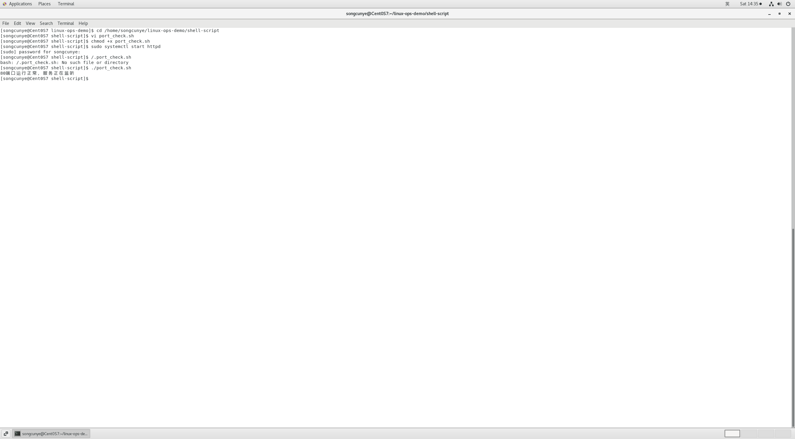
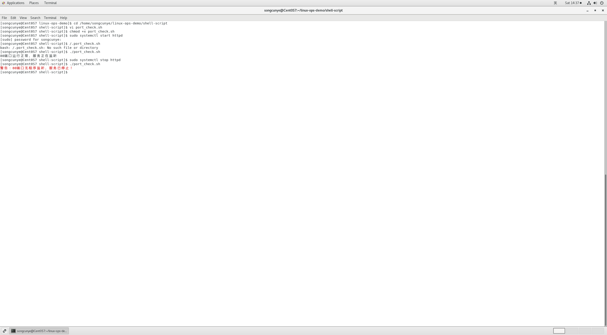

# day4-端口自动化巡检shell脚本.md
## 一、项目概述
运维工作中需要持续监控业务端口监听状态，防止服务意外下线导致业务中断。本Shell脚本自动检测服务器80端口监听进程，无进程占用时输出红色告警；支持配合Linux定时任务crontab实现无人值守周期性巡检，巡检日志持久化存储。
运行环境：CentOS 7

## 二、完整脚本代码
```bash
#!/bin/bash
# 80端口自动化巡检脚本
port=80
# 抓取端口监听进程信息
result=$(ss -tulnp | grep ${port})

# 判断字符串是否为空：空=无进程监听
if [ -z "${result}" ]
then
  echo -e "\033[31m警告：${port}端口无程序监听，httpd服务已停止！\033[0m"
else
  echo "${port}端口运行正常，业务服务正在监听"
fi
```

## 三、部署与测试步骤
### 1. 创建脚本文件
进入仓库shell-script目录，新建脚本
```bash
cd /home/songcunye/linux-ops-demo/shell-script
vi port_check.sh
```
粘贴代码后，按`ESC`输入`:wq`保存退出。

### 2. 添加可执行权限
```bash
chmod +x port_check.sh
```

### 3. 分场景功能测试
#### 场景1：httpd服务正常运行，端口监听正常
```bash
sudo systemctl start httpd
./port_check.sh
```
输出示例：
```
80端口运行正常，业务服务正在监听
```


#### 场景2：停止httpd服务，端口无监听，触发告警
```bash
sudo systemctl stop httpd
./port_check.sh
```
输出示例（红色文字告警）：
```
警告：80端口无程序监听，httpd服务已停止！
```


## 四、拓展：配置定时自动巡检
通过crontab设置每20分钟自动执行脚本，日志写入本地文件长期留存
1. 编辑定时任务
```bash
crontab -e
```
2. 写入定时规则
```cron
*/20 * * * * /home/songcunye/linux-ops-demo/shell-script/port_check.sh >> /var/log/port-monitor.log
```
3. 验证定时任务
```bash
crontab -l
```

## 五、踩坑记录
1. 语法报错：`[ -z ]`判断前后缺少空格
   解决：Shell条件判断符号`[ ]`两侧必须保留空格，严格遵循语法格式。
2. 使用`127.0.0.1`本地回环地址测试防火墙无法阻断端口
   原理：回环流量不经过防火墙过滤，本脚本仅检测本机端口监听状态，不依赖防火墙模拟故障。
3. 图片在GitHub页面无法加载
   解决：截图统一存放至`shell-script/img`目录，文档内图片路径使用相对路径`img/xxx.png`。

## 六、项目总结
1. 使用`ss -tulnp`高效抓取本机端口监听进程，替代老旧`netstat`命令；
2. 通过`-z`参数判断字符串为空，实现端口异常告警逻辑；
3. 结合crontab定时任务，实现服务器自动化巡检，降低人工运维成本；
4. 完整配套测试截图、排坑笔记、部署文档，代码归档GitHub便于复盘展示。

