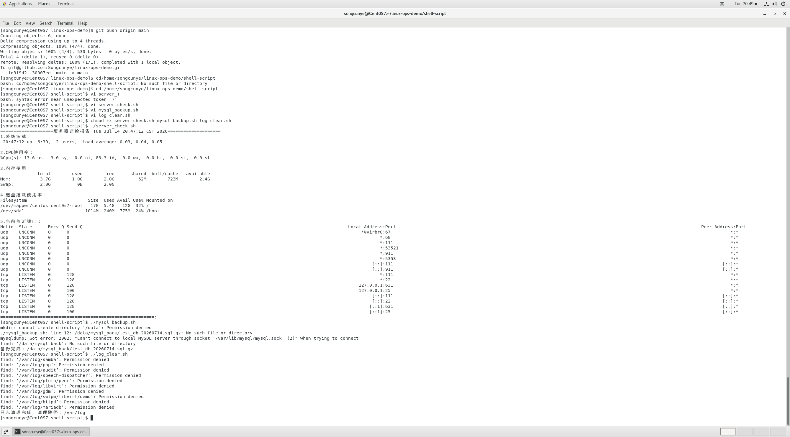
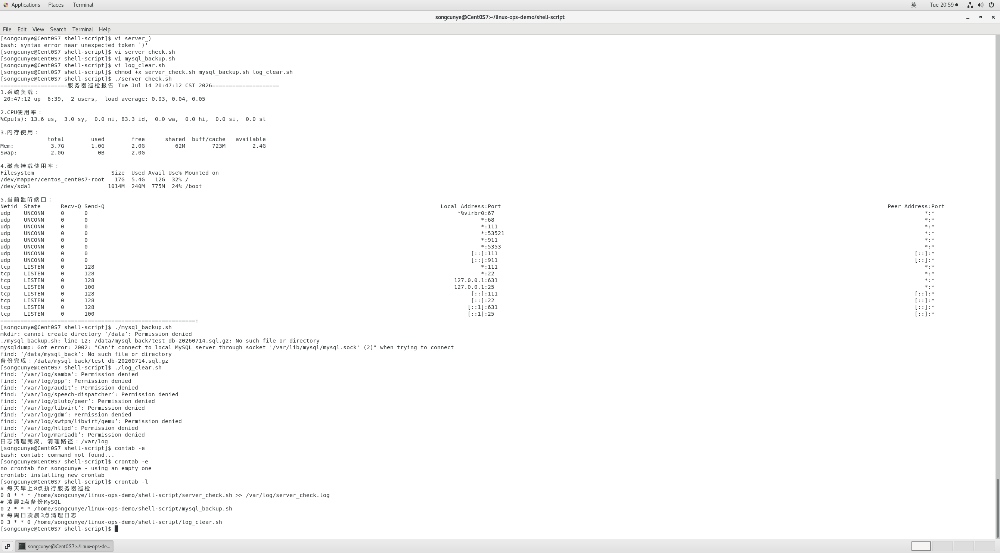

# Shell自动化运维实战笔记
## 运行环境
操作系统：CentOS 7
工具：bash、crontab、mysqldump、gzip

## 一、服务器综合巡检脚本 server_check.sh
### 脚本功能
一键采集服务器运行指标：系统负载、CPU使用率、内存占用、磁盘分区、监听端口
用于日常运维快速排查服务器卡顿、端口占用、磁盘爆满问题。
### 核心命令说明
1. uptime：查看1/5/15分钟系统负载
2. top -b -n 1 | grep Cpu：一次性获取CPU占用信息
3. free -h：人性化格式查看内存
4. df -h | grep -v tmpfs：查看真实磁盘分区使用率，过滤临时内存盘
5. ss -tulnp：查看本机所有TCP/UDP监听端口及对应进程
### 运行效果
执行命令：`./server_check.sh`

### 定时配置
每日早上8点自动执行，输出日志留存
`0 8 * * * /home/songcunye/linux-ops-demo/shell-script/server_check.sh >> /var/log/server_check.log`

## 二、MySQL定时备份脚本 mysql_backup.sh
### 脚本功能
1. 自动导出指定数据库SQL文件并gzip压缩，节省磁盘
2. 自动删除7天前过期备份包，防止磁盘占满
3. 文件按日期命名，方便区分每日备份
### 核心命令说明
1. mysqldump：MySQL官方数据库备份工具
2. date +%Y%m%d：生成年月日时间戳作为备份文件名
3. find -mtime +7 -delete：批量清理7天前备份文件
### 定时配置
每日凌晨2点全量备份数据库
`0 2 * * * /home/songcunye/linux-ops-demo/shell-script/mysql_backup.sh`

## 三、日志自动清理脚本 log_clear.sh
### 脚本功能
定时删除系统/var/log目录下30天以上过期.log日志，避免日志打满磁盘
### 核心命令说明
find 匹配指定路径下30天旧日志并自动删除
### 定时配置
每周日凌晨3点执行日志清理
`0 3 * * 0 /home/songcunye/linux-ops-demo/shell-script/log_clear.sh`

## 四、crontab定时任务总览
查看定时任务命令：`crontab -l`


## 五、脚本权限说明
所有脚本添加执行权限命令：
```bash
chmod +x server_check.sh mysql_backup.sh log_clear.sh
